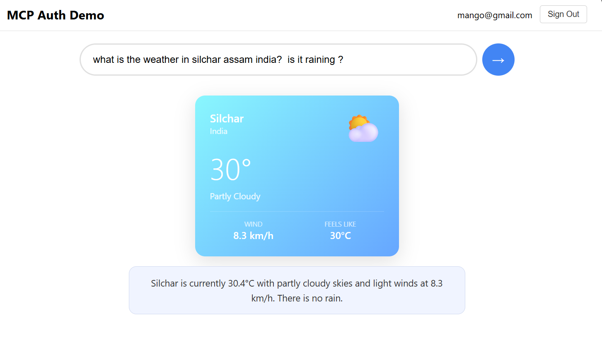
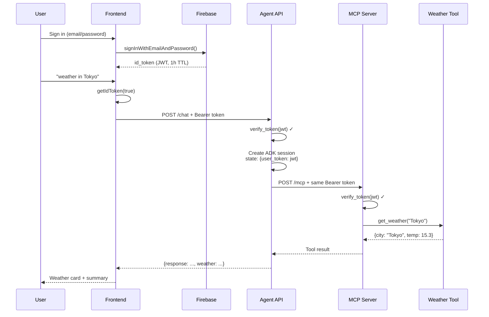
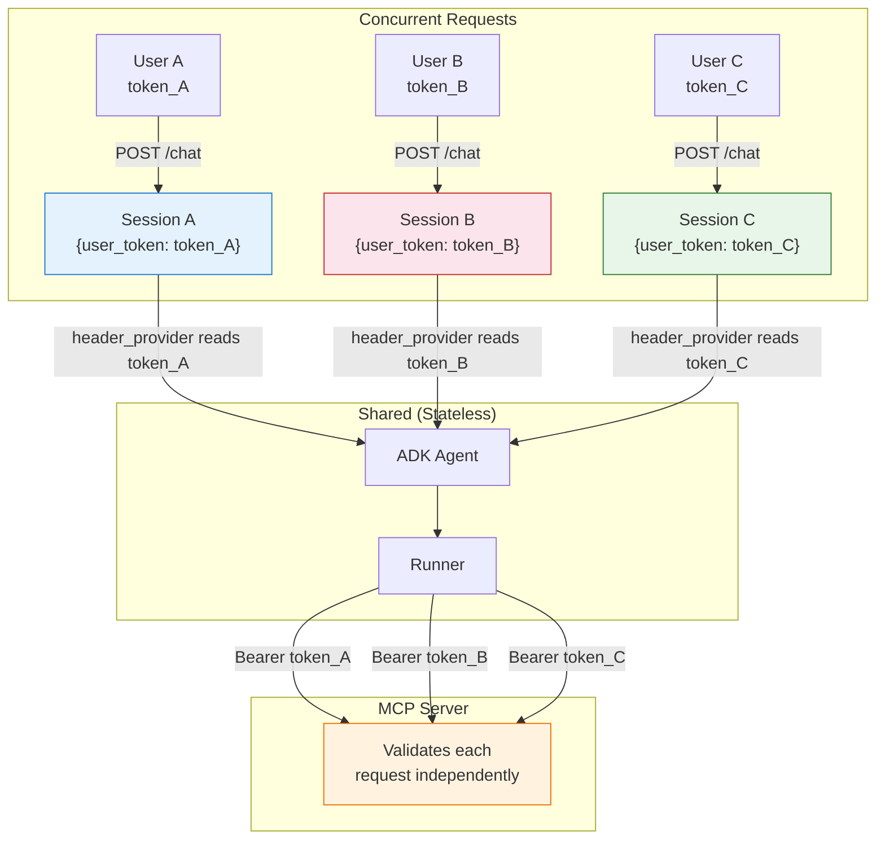
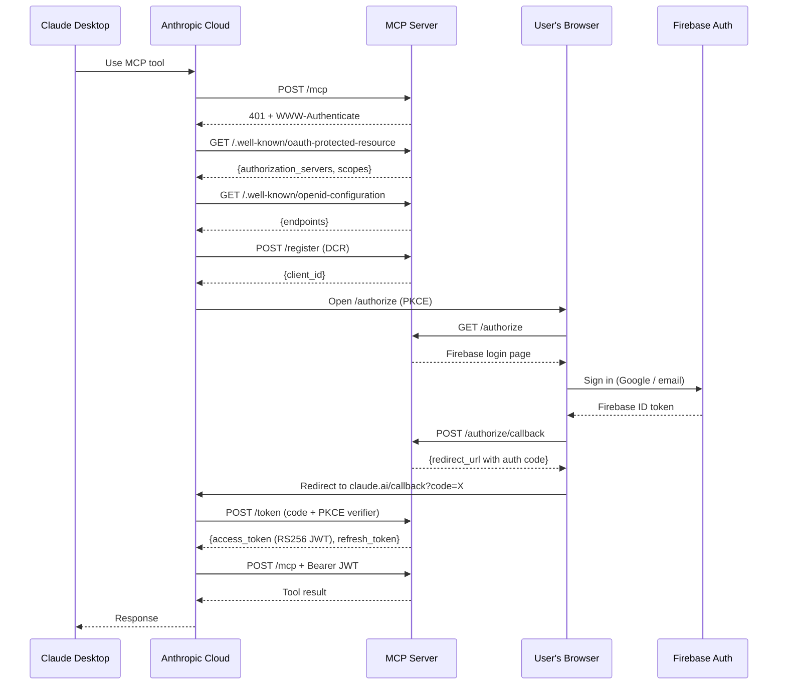

# MCP Auth Demo with Agents

E2E demo of **authenticated MCP (Model Context Protocol)** with multi-user, multi-session support. Firebase Auth tokens flow from the browser through the agent to the MCP server -- same user identity end-to-end.



### Claude Desktop Connector with OAuth 2.1 + DCR Authentication


## Table of Contents

- [Features](#features)
- [Quick Start](#quick-start)
- [Project Structure](#project-structure)
- [Documentation](#documentation)
- [Config Reference](#config-reference)
- [Architecture](#architecture)
- [License](#license)

## Features

| | Feature | Description |
|---|---|---|
| :closed_lock_with_key: | **Firebase Authentication** | Email/password + Google sign-in |
| :shield: | **Per-request token isolation** | Multi-user, multi-session safe |
| :zap: | **Auto-discovery MCP tools** | Drop a file in `mcp-server/tools/`, restart, done |
| :arrows_counterclockwise: | **401-retry client** | `AuthenticatedMCPClient` with automatic token refresh |
| :gear: | **Config-driven** | All settings in YAML, swap LLM models without code changes |
| :bar_chart: | **Structured output** | Agent returns JSON, frontend renders weather cards |
| :bust_in_silhouette: | **Scope-based RBAC** | Tools check scopes from Firebase custom claims |
| :globe_with_meridians: | **OAuth 2.1 + DCR** | Claude Desktop connects via OAuth with Dynamic Client Registration |
| :cloud: | **Cloud Run ready** | Single-port deployment with HTTPS + tunnel support for local testing |

## Quick Start

### Prerequisites

- Firebase project with Email/Password sign-in enabled
- Firebase service account JSON (Project Settings > Service Accounts > Generate)
- Firebase web API key (Project Settings > General > Web API Key)
- One of:
  - **Ollama** running locally with a model (e.g., `ollama pull qwen3.5:9b`)
  - **Gemini API key** from https://aistudio.google.com/apikey

### 1. Configure

```bash
# Copy env templates
cp .env.example .env
cp frontend/.env.example frontend/.env
```

Edit `.env`:
```bash
AUTH_PROVIDER=firebase
FIREBASE_PROJECT_ID=your-firebase-project-id
FIREBASE_SA_PATH=.secrets/firebase-service-account.json

# For Ollama (local)
LLM_MODEL=openai/qwen3.5:9b
LLM_BASE_URL=http://localhost:11434/v1
LLM_API_KEY=ollama
```

Edit `frontend/.env`:
```bash
VITE_FIREBASE_API_KEY=your-firebase-web-api-key
VITE_FIREBASE_AUTH_DOMAIN=your-project.firebaseapp.com
VITE_FIREBASE_PROJECT_ID=your-firebase-project-id
```

Place your Firebase service account JSON:
```bash
mkdir -p .secrets
cp /path/to/your-service-account.json .secrets/firebase-service-account.json
```

### 2. Run with Docker (recommended)

```bash
docker compose up --build -d
```

That's it. Open **http://localhost:8000**, sign in, ask "weather in Tokyo".

| Service | URL | Description |
|---------|-----|-------------|
| Agent API + Frontend | http://localhost:8000 | Single port -- Cloud Run compatible |
| MCP Server | http://localhost:8001 | Internal, called by agent-api |

```bash
# View logs
docker compose logs -f

# Stop
docker compose down
```

### 2b. Run without Docker

Requires: Python 3.12+, Node.js 18+

```bash
# Create conda env (one-time)
conda create -n mcp-auth python=3.12 -y
conda activate mcp-auth

# Install Python dependencies
pip install -r mcp-server/requirements.txt
pip install -r agent-api/requirements.txt

# Install frontend dependencies
cd frontend && npm install && cd ..
```

**Windows:**
```bash
scripts\start.bat          # Starts all 3 services
scripts\stop.bat           # Stops all services
```

**Linux/Mac:**
```bash
chmod +x scripts/start.sh
scripts/start.sh           # Starts all 3 services (Ctrl+C to stop)
```

**Manual (3 terminals):**
```bash
# Terminal 1: MCP Server
PYTHONPATH=. python -m uvicorn run_mcp_server:app --host 0.0.0.0 --port 8001

# Terminal 2: Agent API
PYTHONPATH=. python -m uvicorn run_agent_api:app --host 0.0.0.0 --port 8000

# Terminal 3: Frontend
cd frontend && npm run dev
```

Open http://localhost:5173 (dev) or http://localhost:8000 (Docker).

### 3. Test MCP server directly

```bash
python scripts/test_mcp_server.py <firebase_id_token>
```

## Project Structure

```
mcp-authchain/
├── configs/
│   ├── settings.yaml          # Ports, scopes, roles, LLM config
│   └── agent.yaml             # Agent name, model, instructions
├── commons/
│   ├── config.py              # YAML loader with env var interpolation
│   ├── firebase_auth.py       # Firebase Admin SDK init + token verification
│   ├── mcp_client.py          # AuthenticatedMCPClient + 401-retry
│   ├── token_refresh.py       # Refresh strategies (Firebase REST, WebSocket)
│   └── types.py               # FirebaseUser dataclass
├── mcp-server/
│   ├── main.py                # FastMCP app + pluggable bearer auth middleware
│   ├── auth/                  # Pluggable auth providers (Firebase, Azure AD, JWT)
│   ├── oauth/                 # OAuth 2.1 + DCR for Claude Desktop integration
│   │   ├── endpoints.py       # Well-known, /register, /authorize, /token
│   │   ├── store.py           # In-memory client/code/token storage
│   │   ├── token_service.py   # RS256 JWT minting + verification
│   │   ├── pkce.py            # PKCE S256 validation
│   │   └── templates.py       # Firebase login page HTML
│   └── tools/
│       ├── __init__.py        # Auto-discovery of BaseMCPTool subclasses
│       ├── base.py            # BaseMCPTool base class
│       └── weather.py         # Sample tool: Open-Meteo weather API
├── agent-api/
│   ├── main.py                # FastAPI app entry point
│   ├── auth_middleware.py     # Firebase auth dependency for FastAPI
│   ├── agent_setup.py         # ADK Agent + McpToolset + header_provider
│   ├── service/
│   │   └── agent.py           # AgentService -- agent lifecycle + chat execution
│   ├── routes/
│   │   ├── chat.py            # POST /chat -- thin route, delegates to service
│   │   └── health.py          # GET /health
│   └── utils/                 # Typed MCP client utilities with 401-retry
│       ├── base.py            # BaseToolClient (inherits AuthenticatedMCPClient)
│       └── weather_client.py  # WeatherMCPClient
├── frontend/
│   └── src/
│       ├── App.tsx            # Main app with auth state
│       ├── firebase.ts        # Firebase config
│       ├── api.ts             # API client + structured response parser
│       └── components/
│           ├── Login.tsx       # Email/password + Google sign-in
│           ├── Chat.tsx        # Search input + response rendering
│           └── WeatherCard.tsx # Gradient weather widget
├── scripts/
│   ├── test_mcp_server.py     # MCP server E2E test script
│   ├── start.sh               # Start all services (Linux/Mac)
│   ├── start.bat              # Start all services (Windows)
│   └── stop.bat               # Stop all services (Windows)
├── docs/
│   ├── adding-tools.md        # How to add new MCP tools
│   ├── auth-middleware.md      # How to change auth middleware
│   ├── creating-agents.md      # How to create new agents
│   ├── auth-chain.md          # How the auth chain works (multi-user, multi-session)
│   └── oauth-dcr-setup.md     # OAuth 2.1 + DCR setup for Claude Desktop
└── docker-compose.yml         # All 3 services
```

## Documentation

| Guide | Description |
|-------|-------------|
| [Adding Tools](docs/adding-tools.md) | How to add new MCP tools with auth and scope checking |
| [Auth Middleware](docs/auth-middleware.md) | How to change or replace the auth middleware (Firebase, Auth0, Keycloak, custom) |
| [Creating Agents](docs/creating-agents.md) | How to create new agents, sub-agents, role-based agents, and pass context |
| [Auth Chain](docs/auth-chain.md) | How multi-user, multi-session auth works end-to-end with token isolation |
| [OAuth + DCR Setup](docs/oauth-dcr-setup.md) | How to connect Claude Desktop via OAuth 2.1 with Dynamic Client Registration |

## Claude Desktop Integration


Connect Claude Desktop to your MCP server using OAuth 2.1 + DCR:

```bash
# 1. Add Firebase Web SDK config to .env
FIREBASE_WEB_API_KEY=your-firebase-web-api-key
FIREBASE_AUTH_DOMAIN=your-project.firebaseapp.com

# 2. Start MCP server
conda activate mcp-auth
python -m uvicorn run_mcp_server:app --host 0.0.0.0 --port 8001

# 3. Expose via tunnel (for local testing)
pip install pycloudflared
cloudflared tunnel --url http://localhost:8001
# → https://random-words.trycloudflare.com

# 4. Set OAUTH_ISSUER to tunnel URL in .env and restart server

# 5. In Claude Desktop: Settings → Connectors → Add
#    URL: https://random-words.trycloudflare.com/mcp
```

Claude Desktop will automatically discover OAuth endpoints, register itself (DCR), and open your browser for Firebase login. See [OAuth + DCR Setup](docs/oauth-dcr-setup.md) for the full guide.

## Config Reference

All sensitive config lives in `.env` (gitignored). `configs/settings.yaml` reads from env vars via `${VAR:default}`.

### .env

```bash
# Auth provider: firebase | azure_ad | jwt
AUTH_PROVIDER=firebase
FIREBASE_PROJECT_ID=your-project-id
FIREBASE_SA_PATH=.secrets/firebase-service-account.json

# OAuth 2.1 (for Claude Desktop)
OAUTH_ISSUER=https://your-server.run.app    # Must match public URL
FIREBASE_WEB_API_KEY=your-firebase-web-api-key
FIREBASE_AUTH_DOMAIN=your-project.firebaseapp.com

# LLM
LLM_MODEL=openai/qwen3.5:9b
LLM_BASE_URL=http://localhost:11434/v1
LLM_API_KEY=ollama
```

### Switching auth providers

```bash
# Firebase (default)
AUTH_PROVIDER=firebase

# Azure AD
AUTH_PROVIDER=azure_ad
AZURE_TENANT_ID=your-tenant-id
AZURE_CLIENT_ID=your-client-id

# Generic JWT (Auth0, Keycloak, any OIDC)
AUTH_PROVIDER=jwt
JWT_JWKS_URL=https://your-provider.com/.well-known/jwks.json
JWT_ISSUER=https://your-provider.com/
JWT_AUDIENCE=your-api-audience
```

### Switching LLM models

```bash
# Ollama (local)
LLM_MODEL=openai/qwen3.5:9b
LLM_BASE_URL=http://localhost:11434/v1
LLM_API_KEY=ollama

# Gemini (cloud)
LLM_MODEL=gemini/gemini-2.5-flash
GEMINI_API_KEY=your-gemini-api-key
```

## Architecture

### System Overview

```mermaid
graph LR
    subgraph Browser
        FE["Frontend<br/><small>React + Vite</small>"]
        FB["Firebase Auth<br/><small>Login UI</small>"]
    end

    subgraph Agent API :8000
        MW["Auth Middleware<br/><small>Validates Firebase JWT</small>"]
        ADK["Google ADK Agent<br/><small>LiteLLM / Ollama</small>"]
        SS["Session Service<br/><small>Per-user isolation</small>"]
    end

    subgraph MCP Server :8001
        BM["Bearer Auth<br/><small>Pluggable provider</small>"]
        FM["FastMCP<br/><small>Streamable HTTP</small>"]
        TL["Tools<br/><small>Auto-discovered</small>"]
    end

    subgraph External
        WA["Weather API<br/><small>Open-Meteo</small>"]
    end

    FB -->|"id_token"| FE
    FE -->|"Bearer token"| MW
    MW --> SS
    SS -->|"token in session"| ADK
    ADK -->|"same Bearer token<br/><small>via header_provider</small>"| BM
    BM --> FM
    FM --> TL
    TL --> WA

    style Browser fill:#e8f4fd,stroke:#4285f4
    style FM fill:#e8f5e9,stroke:#34a853
    style ADK fill:#fce4ec,stroke:#ea4335
    style BM fill:#fff3e0,stroke:#fbbc04
    style MW fill:#fff3e0,stroke:#fbbc04
```



### Auth Token Flow



### Multi-User Session Isolation



**Same user identity end-to-end.** The Firebase JWT token issued at login flows unchanged from browser → agent-api → MCP server. The MCP server sees the actual user, not a service account.

**Multi-user safe.** Each request creates an isolated ADK session. User A's token never leaks to User B. The MCP server is stateless -- validates every request independently.

### Claude Desktop OAuth Flow



The MCP server supports **dual authentication**: Firebase tokens (from the frontend/agent-api) and OAuth-issued RS256 JWTs (from Claude Desktop). Both are validated by the same `BearerAuthMiddleware`.

## License

MIT
